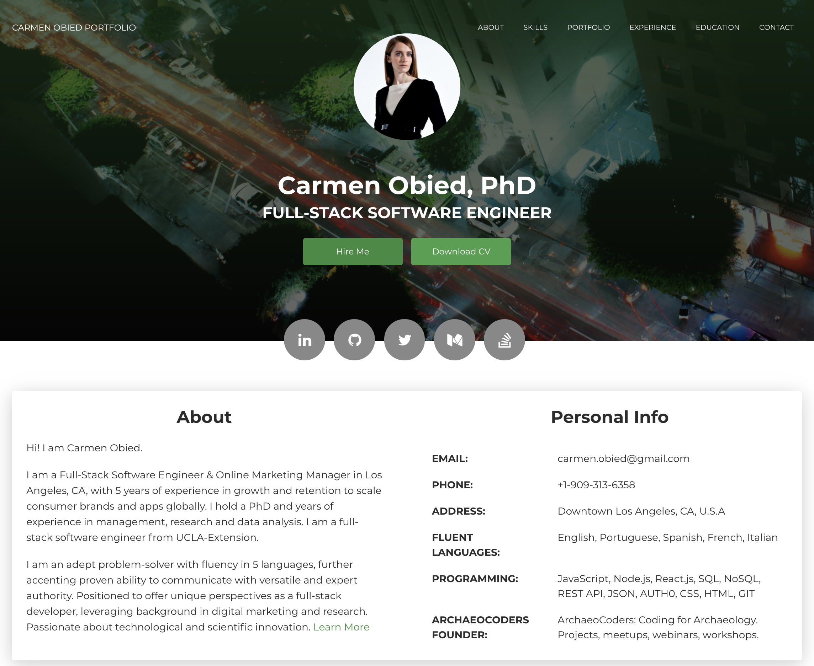

# Portfolio Full-Stack Software Engineering


Personal portfolio page to highlight experience in full-strack software engineering, projects, resume, and more. 

Explore my portfolio page and resume here: https://carmenobied.github.io/Portfolio-Software-Engineer/

# Table of Contents
  * [User Story](#User-Story)
  * [Installation](#Installation)
  * [Usage](#Usage)
  * [Credits](#Credits)
  * [Contributing](#Contributing)
  * [License](#License)
  * [Tests](#License)
  * [Questions](#Questions)

## Installation
```
i. Fork the Github repository.
ii. Clone the forked repo into your local machine using gitbash/terminal to pull the project and data.
iii. Access the html, css and js files and assets via Visual Studio or in your browser to view the code and website respectively.  
iv. Open and explore the page.
```

## Usage
```bash
Creative CV HTML template built with Bootstrap 4 and Now UI Kit.
```

View Portfolio and Resume [here](https://carmenobied.github.io/Portfolio-Software-Engineer/). 

See screenshot below which demonstrates the application:


## Credits
Creative CV HTML template copyright (c) [2020] [Creative CV Template | TemplateFlip]

## Contributing
Pull requests are welcome. Please use the [Contributor Covenant Code of Conduct](https://www.contributor-covenant.org/version/2/0/code_of_conduct/code_of_conduct.md) and for major changes, please open an issue beforehand to discuss the changes.

## License 
[MIT](https://github.com/carmenobied/Portfolio-Website/blob/master/LICENSE) | Copyright © 2020 Carmen Obied

## Tests 
There are currently no tests for this project.

## Questions  
Have questions? Contact me at:
##### Email: carmen.obied@gmail.com
##### Github:  **carmenobied** [carmenobied](https://github.com/carmenobied)
