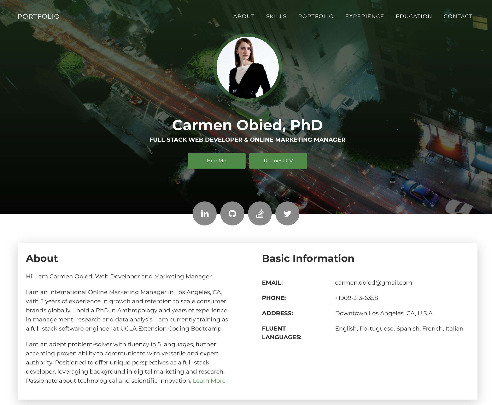

# PortfolioL Full-Stack Web Development 

Personal portfolio page to highlight experience in full-strack development and increase online presence. 

Explore my portfolio page here: https://carmenobied.github.io/portfolio/

## Installation
```
i. Fork the Github repository.
ii. Clone the forked repo into your local machine using gitbash/terminal to pull the project and data.
iii. Access the html, css and js files and assets via Visual Studio or in your browser to view the code and website respectively.  
iv. Open and explore the page.
```

## Usage
```bash
Creative CV HTML template built with Bootstrap 4 and Now UI Kit.
```

See screenshot below which demonstrates the application:


## Credits
Creative CV HTML template copyright (c) [2020] [Creative CV Tempate | TemplateFlip]

## License
MIT License

Copyright (c) [2020] [Carmen Obied]

Permission is hereby granted, free of charge, to any person obtaining a copy of this software and associated documentation files (the "Software"), to deal in the Software without restriction, including without limitation the rights to use, copy, modify, merge, publish, distribute, sublicense, and/or sell copies of the Software, and to permit persons to whom the Software is furnished to do so, subject to the following conditions:

The above copyright notice and this permission notice shall be included in all copies or substantial portions of the Software.

THE SOFTWARE IS PROVIDED "AS IS", WITHOUT WARRANTY OF ANY KIND, EXPRESS OR IMPLIED, INCLUDING BUT NOT LIMITED TO THE WARRANTIES OF MERCHANTABILITY, FITNESS FOR A PARTICULAR PURPOSE AND NONINFRINGEMENT. IN NO EVENT SHALL THE AUTHORS OR COPYRIGHT HOLDERS BE LIABLE FOR ANY CLAIM, DAMAGES OR OTHER LIABILITY, WHETHER IN AN ACTION OF CONTRACT, TORT OR OTHERWISE, ARISING FROM, OUT OF OR IN CONNECTION WITH THE SOFTWARE OR THE USE OR OTHER DEALINGS IN THE SOFTWARE.```
